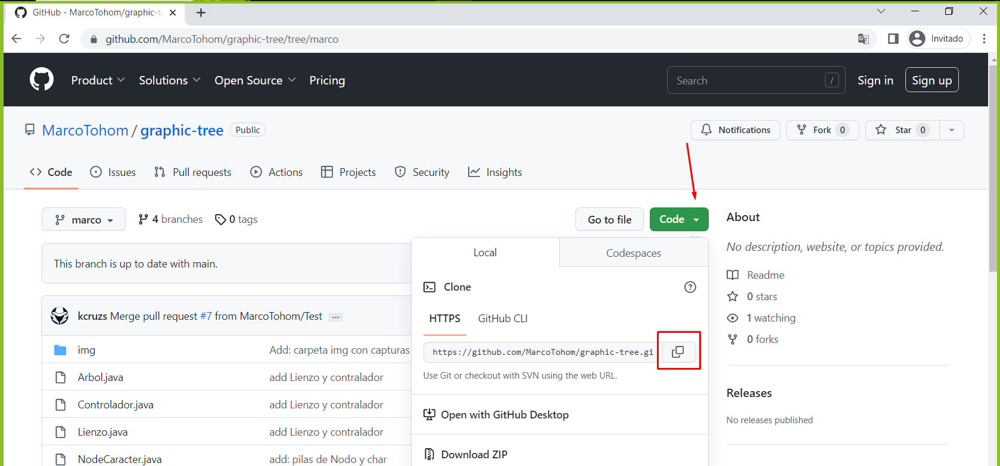

    

# **Proyecto 1 Arboles de Expresion (grafico)**
Aplicación que recibe un texto con una expresión matemática limitada
en sumas, restas, multiplicaciones, divisiones, potencias y raices. Como la siguiente expresión
a + b – (c – b) + e

Luego muestra los recorridos del árbol.

Por último muestra el árbol de forma gráfica.

## **Requerimientos**
- JDK versión 8 o superior
- Git versión 2 o superior

## **Instalación**
- Ingresar al repositorio
- Hacer clic en el botón Code
- Hacer clic en el botón para copiar código.

- Ingresar a la terminal de su computadora y clonar el repositorio con el siguiente documento

## **Documentación**

## Capturas de funcionamiento
**Solicitud de ingreso de datos.**

**Ingreso de datos para la validacion en el árbol**

**Impresion del árbol en terminal y recorridos**

**Expresion del arbol en forma grafica**

 

 
 
 
 

#
## Integrantes:
- **Marco Antonio Tohom** - _7690-15-24753_ - [MarcoTohom](https://github.com/MarcoTohom)
- **Kevin Gustavo Cruz** - _7690-10-144_ - [kcruzs](https://github.com/kcruzs)
- **Vanni Alcantara** - _7690-18-1298_ - [Vanii-UMG](https://github.com/Vanii-UMG)